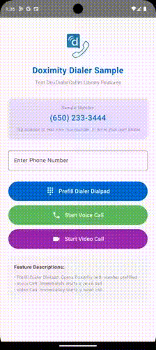
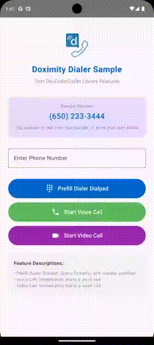

# CallWithDoxDialer for Android

<p align="center">
	<a href="https://github.com/doximity/android-dialer-call-lib/"></a><br /><br />
	A µLibrary for making calls using <a href="https://www.doximity.com/clinicians/download/dialer/">Doximity Dialer</a>.<br /><br />
</p>
<br />


## What is CallWithDoxDialer?

Doximity's [Dialer][] app lets healthcare professionals make phone calls to patients while on the go -- without revealing personal phone numbers. Calls are routed through Doximity's HIPPA-secure platform and relayed to the patient who will see the doctor's office number in the Caller ID. Doximity Dialer is currently available to verified physicians, nurse practitioners, physician assistants and pharmacists in the United States. 

CallWithDoxDialer is a mobile library for Android that lets 3rd-party apps easily initiate calls through the Doximity Dialer app.


## Other Platforms

* [iOS](https://github.com/doximity/CallWithDoxDialer)

## Sample App

A sample project which provides runnable code examples that demonstrate uses of the class in this library is available in the `/CallWithDoxDialerSample` folder. 





## Download

**Method 1: Using JitPack**

Add JitPack repository in your `settings.gradle.kts`:
```kotlin
dependencyResolutionManagement {
    repositories {
        google()
        mavenCentral()
        maven { url = uri("https://jitpack.io") }
    }
}
```

Then add the dependency to your app's `build.gradle.kts`:
```kotlin
dependencies {
    implementation("com.github.doximity:android-dialer-call-lib:vX.X.X")
}
```

<details>
<summary>Using Groovy (build.gradle)</summary>

Add JitPack repository in your root `build.gradle`:
```groovy
allprojects {
    repositories {
        ...
        maven { url 'https://jitpack.io' }
    }
}
```

Add the dependency:
```groovy
dependencies {
    implementation 'com.github.doximity:android-dialer-call-lib:vX.X.X'
}
```
</details>

**Note:** Replace `X.X.X` with the latest version from https://jitpack.io/#doximity/android-dialer-call-lib

**Method 2: Local Module**

In `settings.gradle.kts`:
```kotlin
include(":YourApp", ":CallWithDoxDialerLib")
```

Then add the dependency to your app's `build.gradle.kts`:
```kotlin
dependencies {
    implementation(project(":CallWithDoxDialerLib"))
}
```

## Using CallWithDoxDialer

### Core Functionality

CallWithDoxDialer provides three functions for initiating calls through Doximity Dialer. First, get an instance of the DoxDialerCaller:

```kotlin
val doxDialer = DoxDialerCaller.getInstance()
```

#### 1. Prefill the Dialer Dialpad
To prefill the Doximity Dialer dialpad with a phone number and let the user choose the communication type (voice, video, or text), call:
```kotlin
doxDialer.dialPhoneNumber(context: Context, phoneNumber: String): Boolean
```

This opens Doximity Dialer with the number prefilled, allowing the user to select their preferred communication method.

#### 2. Start an Immediate Voice Call
To immediately initiate a voice call through Doximity Dialer, call:
```kotlin
doxDialer.startVoiceCall(context: Context, phoneNumber: String): Boolean
```

This bypasses the dialer screen and starts a voice call directly.

#### 3. Start an Immediate Video Call
To immediately initiate a video call through Doximity Dialer, call:
```kotlin
doxDialer.startVideoCall(context: Context, phoneNumber: String): Boolean
```

This bypasses the dialer screen and starts a video call directly.

**Note:** If the Doximity Dialer app is not installed, all functions will direct the user to Doximity Dialer on the Play Store. All functions return true if the Doximity app is launched or if the Play Store is opened, and false otherwise.

### Supported Phone Number Formats
All methods accept most reasonable phone number formats, e.g.:
- using numbers only: `4151234567`
- formatted: `(415)123-4567`
- with a leading international area code: `+1(415)123-4567`


### Icons
The library also includes a version of the Doximity Dialer icon appropriate for use inside Button or ImageView.
It's available in the `/DoxDialerIconDrawables` folder.


## Have a question?
If you need any help, please reach out! <dialer@doximity.com>.


[Dialer]: https://www.doximity.com/clinicians/download/dialer
